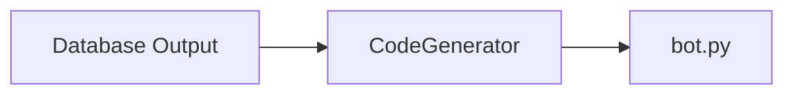

# Discord Bot Maker
## Introduction
 This is my first CLI [Command Line Interface]. This is a tool which can create you a simple discord bot without coding. Currently this tool got only two tools :
 1. **Simple Message** : a style of message which contains only **2** attributes which are:
	 - *cmd_name /command name* : Name of command.
	 - *reply* : Message bot will reply with
	 - *private* : Private is a bool, if its true bot will send message to user in DM and if its false bot will send to channel command was invoke. 
	 
 2. **Embed Message** : a style of message which contains **6** attributes which are:
	- *cmd_name/command name* : Name of command.
	- *title*  : Title of embed.
	- *reply* : Description of embed message.
	- *footer* : Footer of embed message.
	- *color* : Color of embed message.
	- *private* : Private is a bool, if its true bot will send message to user in DM and if its false bot will send to channel command was invoke.

3. **Waiting to be created by you :)**

## How to use tool?
### Attributes used in CLI
All Attributes used in CLI with there info:
1. **New Project**
	- `-np` : Name of new Project.
	- `-npth` : Path of New Project `folder should be empty`
2. **Simple Message**
	- `-p` : Project you wanna use. Only if project is already created.
	- `-type` : Type of message you are going to add, Will be *Simple* .
	- `-n` : Name of your command/cmd_name.
	- `-r` : Reply text of your message.
	- `-prv` : `Bool` if message is private.
3. **Embed Message**
	- `-p` : Project you wanna use. Only if project is already created.
	- `-type` : Type of message you are going to add,  Will be*Embed*.
	- `-n` : Name of your command/cmd_name.
	- `-t` : Title of embed message.
	- `-r` : Description text of your message.
	- `-foot` : Footer text of embed message.
	- `-c` : Color of embed message in hex, `example: F4F482`
	- `-prv` : `Bool` if message is private.
4. **Miscellaneous**
	- `--commands` : All commands in a project, `-p` is required.
	- `--projects` : Show list of all Projects.
	- `-delp` : Delete project by its name, `example: -delp simplebot`
	- `-delc` : Delete a command in a `-p` by its name, `example : -delc hey -p simplebot`
	- `--finish` : Finish the project and create `bot.py` files. All required commands are :
		- `-p` : Name of project you wanna finish.
		- `-prefix` : Prefix of your bot.
		- `-token` : Token of your bot.
	
	>Note : `-p` is important for every command to tell CLI which project to edit.

## How tool works?
Bot Maker use *jinja2* to create `bot.py` and other command templates. Now how tool take inputs as a CLI, Bot Maker use `argparse` as a CLI module of python.

**ALL IN A FLOW**
> When we run and provide input in CLI.
```mermaid
graph LR
	CLI[CLI Input] --> LV[Local Variables]
	LV --> C[Command Class]
	C --> Simple[Simple message]
	C --> Embed[Embed Message]
	Simple --> db[Database]
	Embed --> db[Database]
 ```
 > When we press enter after giving Inputs.
```mermaid
graph LR
	db[Database] --> CM[CodeGenerator]
	CM --> dbo[Database Output]
```
> When we use `--finish` in CLI.

## User Variables
### `[user]` variable
 1. `[user]` : Mention user who invoke the command.
 2. `[user.id]` : User's ID who invoke the command.
 3. `[user.name]` : User's  name who invoke the command.
 4. `[user.discriminator]` : Discriminator of User who invoke command.
 5. `[user.avatar_url]` : User's Avatar URL who invoke command.
 
 ### `[server]` variable
 1. `[server]` : Server's name.
 2. `[server.id]` : Server's ID.
 3. `[server.icon_url]` : Server's icon URL.
 4. `[server.owner]` : Mention Server's Owner
 5. `[server.owner_id]` : Server's Owner's ID.
 6. `[server.region]` : Server's Region.
 7. `[server.member_count]` : Total members in Server.
 
 ### `[channel]` variable
1. `[channel]` : Mention channel in which command was invoke.
2. `[channel.name]` : Name of channel in which command was invoke.
3. `[channel.id]` : Id of channel in which command was invoke.

## License
>  Copyright **2021  its-deep-inside**

>Permission is hereby granted, free of charge, to any person obtaining a copy of this software and associated documentation files (the "Software"), to deal in the Software without restriction, including without limitation the rights to use, copy, modify, merge, publish, distribute, sublicense, and/or sell copies of the Software, and to permit persons to whom the Software is furnished to do so, subject to the following conditions:

>The above copyright notice and this permission notice shall be included in all copies or substantial portions of the Software.

>THE SOFTWARE IS PROVIDED "AS IS", WITHOUT WARRANTY OF ANY KIND, EXPRESS OR IMPLIED, INCLUDING BUT NOT LIMITED TO THE WARRANTIES OF MERCHANTABILITY, FITNESS FOR A PARTICULAR PURPOSE AND NONINFRINGEMENT. IN NO EVENT SHALL THE AUTHORS OR COPYRIGHT HOLDERS BE LIABLE FOR ANY CLAIM, DAMAGES OR OTHER LIABILITY, WHETHER IN AN ACTION OF CONTRACT, TORT OR OTHERWISE, ARISING FROM, OUT OF OR IN CONNECTION WITH THE SOFTWARE OR THE USE OR OTHER DEALINGS IN THE SOFTWARE.

### Dev Note
Hey there Dev, This is my first tool so you will get many bugs and issues and i can not solve them alone so i hope you guys are with me and help me in this project this project is opensource.
This is TO-DO list
- [x] Base of Project.
- [x] Simple CLI
- [ ] Error handling
- [ ] User Friendly
- [ ] GUI
> I hope you guys will contribute.
>[BeingHuman - YouTube](https://www.youtube.com/channel/UC6v68SX6drjiQey5dR734Cw)
 > [BeingHuman (@beinghumanyt)](https://www.instagram.com/beinghumanyt/)
 > [BeingHuman (@BeingHu83647320) / Twitter](https://twitter.com/BeingHu83647320)